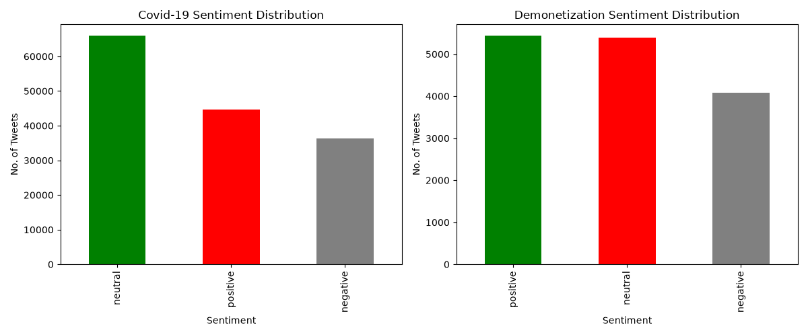
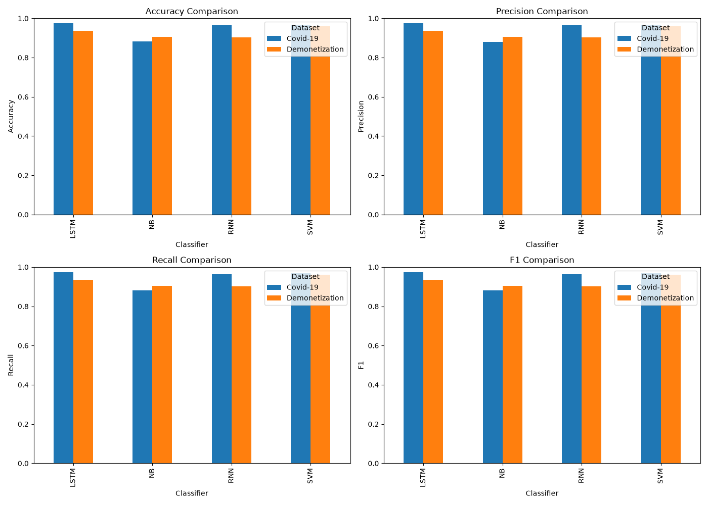

# Twitter Sentiment Analysis on Demonetization and COVID-19 Tweets


A Python implementation inspired by **“Apache Hadoop based effective sentiment analysis on demonetization and covid-19 tweets.”** The project preprocesses two Twitter datasets, generates three-class sentiment labels with VADER, and compares classical machine learning and recurrent neural networks.

> **Implementation scope:** The notebook runs locally with pandas, NLTK, scikit-learn, and TensorFlow. It adapts the paper's sentiment-classification workflow; Hadoop, HDFS, Apache Pig, and Apache Flume are not implemented. Results below are the saved experiment outputs, evaluated against automatically generated VADER labels.

---

## Paper Information

| Detail | Information |
|--------|-------------|
| **Title** | Apache Hadoop based effective sentiment analysis on demonetization and covid-19 tweets |
| **Authors** | S. Anitha and Mary Metilda |
| **Institutions** | Dwaraka Doss Goverdhan Doss Vaishnav College; Queen Mary's College, Chennai, India |
| **Published in** | Global Transitions Proceedings 3 (2022), 338–342 |
| **DOI** | [10.1016/j.gltp.2022.03.021](https://doi.org/10.1016/j.gltp.2022.03.021) |
| **Paper in this repository** | [RP_project.pdf](RP_project.pdf) |

## Overview

The project investigates how SVM, Naive Bayes, SimpleRNN, and LSTM classify **positive**, **negative**, and **neutral** tweets about COVID-19 and demonetization.

The workflow consists of data selection, text cleaning, tokenization, stop-word removal, stemming, VADER labeling, feature extraction, model training, and evaluation. Each dataset has its own vectorizer, tokenizer, and trained models.

```text
Tweet CSVs
    |
English filter for COVID-19 + text cleaning
    |
Lowercase -> tokenize -> remove stop words -> Porter stemming
    |
VADER compound score -> positive / negative / neutral labels
    |
    +-- TF-IDF (5,000 features) ----------> Linear SVM / Multinomial NB
    |
    +-- Token sequences (length 50) -----> SimpleRNN / LSTM
                                              |
                           Stratified 80/20 train/test evaluation
                                              |
                           Metrics CSV + comparison visualizations
```

## Datasets

### Files used for the reported experiments

| Property | COVID-19 | Demonetization |
|----------|----------|----------------|
| **File** | `Covid-19/Covid-19 Twitter Dataset (Apr-Jun 2021).csv` | `Demonatization/demonetization-tweets.csv` |
| **Raw records** | 147,475 | 14,940 |
| **CSV columns** | 17 | 16 |
| **Observed date range** | April 26–June 27, 2021 | November 22, 2016–April 21, 2017 |
| **Input text field** | `original_text` | `text` |
| **Language handling** | Keep rows with `lang == 'en'` | No explicit language detector/filter |
| **Final records** | 146,764 | 14,912 |
| **Training records** | 117,411 | 11,929 |
| **Test records** | 29,353 | 2,983 |

The COVID-19 CSV already contains `clean_tweet`, sentiment scores, and a `sentiment` column. The notebook discards these fields and computes its own cleaned text and VADER labels. The demonetization CSV contains two index-like fields, `s.no` and `X`; its actual schema has 16 columns, while the paper describes 15 attributes.

Two additional COVID-19 files are present but **are not used in the saved experiments**:

| File | Raw records | Columns |
|------|-------------|---------|
| `Covid-19 Twitter Dataset (Apr-Jun 2020).csv` | 143,903 | 17 |
| `Covid-19 Twitter Dataset (Aug-Sep 2020).csv` | 120,509 | 17 |

The paper identifies Kaggle as its source, but exact download URLs, versions, and licensing information for the local CSVs are not recorded in this folder. The COVID-19 experiment uses 2021 data, whereas the paper describes January–May 2020. The notebook does not apply an India-only filter. Verify dataset provenance and redistribution terms before publishing the raw files.

### Preprocessing counts

| Stage | COVID-19 | Demonetization |
|-------|---------:|---------------:|
| Original CSV | 147,475 | 14,940 |
| After language selection | 147,474 | 14,940 |
| After removing text empty after basic cleaning | 146,799 | 14,913 |
| After removing text empty after NLP preprocessing | **146,764** | **14,912** |

Counts are taken from the notebook's saved outputs. Raw file dimensions and date ranges were also checked directly against the CSVs.

## Methods Used

### Step 1 — Basic Text Cleaning

The `basic_clean()` function removes leading `RT @user:` prefixes, user mentions, URLs, and hashtag markers while retaining hashtag words. It then removes all characters outside ASCII letters and whitespace, including numbers, punctuation, and emojis, and strips surrounding whitespace. Rows with empty text are removed.

Removing the retweet prefix does not remove retweeted or duplicate records. The notebook overwrites its working `raw_text` column with this cleaned text; the original text remains available in the source CSVs.

### Step 2 — NLP Preprocessing

The `preprocess()` function applies the following sequence:

1. Convert text to lowercase.
2. Tokenize using NLTK `word_tokenize`.
3. Retain alphabetic tokens.
4. Remove NLTK English stop words.
5. Stem tokens with `PorterStemmer`.
6. Join tokens into `clean_text` and remove empty results.

### Step 3 — VADER Sentiment Labeling

NLTK's `SentimentIntensityAnalyzer` scores the **stemmed `clean_text`**. The notebook stores the compound score in `avg_r` and applies these rules:

| Compound score | Label |
|----------------|-------|
| Greater than `0.0` | `positive` |
| Less than `0.0` | `negative` |
| Exactly `0.0` | `neutral` |

The field name `avg_r` follows the paper's terminology, but VADER's compound score is **not the paper's arithmetic average of dictionary word ratings**. These generated labels become the training and evaluation targets for all four classifiers.

### Step 4 — Feature Extraction

| Model family | Representation | Explicit settings |
|--------------|----------------|-------------------|
| SVM and NB | Separate TF-IDF matrix per dataset | `TfidfVectorizer(max_features=5000)`; other options use library defaults |
| RNN and LSTM | Separate integer-token sequences per dataset | `Tokenizer(num_words=5000)` and `pad_sequences(maxlen=50)`; default pre-padding/pre-truncation |

Neural-network labels are encoded as `0 = negative`, `1 = neutral`, and `2 = positive`, then converted to three-class one-hot vectors. The current notebook fits both the TF-IDF vocabulary and neural tokenizer on the full cleaned corpus before the train/test split; see the limitations below.

### Step 5 — Training Configuration

| Setting | Value in the notebook |
|---------|-----------------------|
| Train/test split | 80% / 20% |
| Stratification | Sentiment label |
| Split seed | `random_state=42` |
| SVM | `LinearSVC(class_weight='balanced', max_iter=2000)` |
| Naive Bayes | `MultinomialNB()` with library defaults |
| Neural embedding | Vocabulary size `5000`, embedding dimension `64` |
| Input sequence length | `50` |
| Recurrent layer | `SimpleRNN(64)` or `LSTM(64)`, `return_sequences=False` |
| Hidden dense layer | `32` units, ReLU |
| Output layer | `3` units, softmax |
| Optimizer | `'adam'`; learning rate not explicitly set |
| Loss | `categorical_crossentropy` |
| Batch size | `128` |
| Maximum epochs for final neural models | `10` |
| Validation split | `0.1` of the training data |
| Early stopping | Monitor `val_loss`, patience `2`, restore best weights |
| TensorFlow/NumPy training seed | Not explicitly set |

The RNN cell first trains two preliminary models for **5 epochs**. It then creates fresh RNN models and trains them with the final 10-epoch/early-stopping configuration. Reported RNN metrics refer to those replacement models. LSTM is an additional experiment beyond the paper's three classifiers.

### Step 6 — Evaluation and Export

All models are evaluated on their held-out test split. Accuracy is reported directly; precision, recall, and F1 use **support-weighted averaging** across the three sentiment classes. The notebook writes the final eight model/dataset rows to `classification_results.csv` and generates two PNG visualizations.

The current implementation does not calculate ROC-AUC or perform the paper's 10-fold cross-validation.

---

## Results

### Sentiment Distribution

| Dataset | Positive | Negative | Neutral | Total |
|---------|---------:|---------:|--------:|------:|
| COVID-19 | 44,586 | 36,257 | 65,921 | 146,764 |
| Demonetization | 5,435 | 4,084 | 5,393 | 14,912 |

Neutral is the largest VADER-generated class in the COVID-19 dataset. Positive and neutral counts are close in the demonetization dataset. These distributions describe the labeling procedure's output, rather than independently annotated public opinion.



Read the sentiment names on the x-axis: this saved figure assigns colors by descending count, so a color does not represent the same class in both panels.

### Classifier Performance

All values below are percentages rounded to two decimal places from [classification_results.csv](classification_results.csv). The CSV retains scores on the 0–1 scale.

| Dataset | Classifier | Accuracy (%) | Weighted precision (%) | Weighted recall (%) | Weighted F1 (%) |
|---------|------------|-------------:|-----------------------:|--------------------:|----------------:|
| COVID-19 | SVM | 96.86 | 96.85 | 96.86 | 96.84 |
| COVID-19 | NB | 88.18 | 88.12 | 88.18 | 88.10 |
| COVID-19 | RNN | 96.41 | 96.39 | 96.41 | 96.40 |
| COVID-19 | **LSTM** | **97.48** | **97.47** | **97.48** | **97.47** |
| Demonetization | **SVM** | **96.01** | **96.04** | **96.01** | **96.00** |
| Demonetization | NB | 90.51 | 90.58 | 90.51 | 90.51 |
| Demonetization | RNN | 90.24 | 90.32 | 90.24 | 90.23 |
| Demonetization | LSTM | 93.53 | 93.53 | 93.53 | 93.53 |



### Key Findings

| Finding | Saved experiment result |
|---------|-------------------------|
| Best COVID-19 classifier | LSTM: **97.48%** accuracy |
| Best demonetization classifier | SVM: **96.01%** accuracy |
| LSTM versus SimpleRNN | Higher accuracy on both datasets: approximately **1.06** and **3.29** percentage points, respectively |
| SVM consistency | Above **96%** accuracy on both datasets |
| Lowest COVID-19 accuracy | NB: **88.18%** |
| Lowest demonetization accuracy | RNN: **90.24%**, slightly below NB |

These are measurements from the saved run, not a guarantee of identical scores after retraining. Neural initialization is not seeded, and the repository does not include a locked dependency environment or saved model weights.

## Comparison with the Original Paper

| Aspect | Original paper | This implementation |
|--------|----------------|---------------------|
| Execution | Hadoop ecosystem, HDFS, Flume, Pig | Local Python notebook |
| Sentiment scoring | Dictionary word rates and average score | VADER compound score on stemmed text |
| Zero-score label | Algorithm lists `>= 0` as positive, leaving its numeric neutral branch unreachable | Exactly zero is neutral |
| COVID-19 period | January–May 2020 | April–June 2021 file |
| Demonetization dimensions | 14,940 instances, 15 attributes | 14,940 rows, 16 CSV columns; 14,912 rows after cleaning |
| Regional-language handling | Describes Hindi/Tamil as eliminated and considered neutral | COVID-19 English filter; ASCII cleaning, no explicit regional-language neutral rule |
| Models | SVM, NB, RNN | SVM, NB, SimpleRNN, plus LSTM |
| Evaluation | 10-fold cross-validation | One stratified 80/20 split |
| Metrics | Accuracy, precision, recall, F-measure, ROC | Accuracy and weighted precision/recall/F1 |

### Accuracy Reference

| Dataset | Model | Paper accuracy (%) | Saved notebook accuracy (%) |
|---------|-------|-------------------:|----------------------------:|
| COVID-19 | SVM | 70.66 | 96.86 |
| COVID-19 | NB | 66.97 | 88.18 |
| COVID-19 | RNN | 69.34 | 96.41 |
| Demonetization | SVM | 92.25 | 96.01 |
| Demonetization | NB | 73.00 | 90.51 |
| Demonetization | RNN | 87.00 | 90.24 |

Paper values come from Tables 3 and 4. The paper's results prose also states 98.25% for demonetization SVM, conflicting with Table 4's 92.25%; the table value is used here.

**These figures are not a controlled improvement comparison.** Data periods, scoring/labeling methods, and evaluation protocols differ, and the paper does not provide enough implementation detail for an exact numerical replication.

## Limitations and Reproducibility

- **Automatically generated targets:** Test labels come from the same VADER procedure as training labels. High accuracy demonstrates agreement with that procedure; it does not establish accuracy against human sentiment annotations.
- **Vocabulary leakage:** TF-IDF and tokenizers are fitted before splitting, allowing test-corpus vocabulary and, for TF-IDF, document-frequency information into feature construction. A stricter evaluation should fit them only on training text.
- **Repeated tweets:** No deduplication or group-based split is implemented. The raw demonetization file contains 9,793 repeated-text rows beyond the first occurrence of each text (5,147 distinct texts across 14,940 rows). Related or identical tweets may appear in both splits and inflate scores.
- **Loss of sentiment cues:** Removing punctuation, emojis, stop words, and then stemming before VADER changes its input and can remove negation or dictionary matches. The README documents this existing behavior.
- **Run reproducibility:** Only the train/test split is explicitly seeded. Dependency versions are not pinned, and model weights, test predictions, and fold-level results are not saved.
- **Paper fidelity:** Distributed processing, exact word-rate scoring, and 10-fold evaluation remain unimplemented. RNN hyperparameters and the dictionary used in the paper are not specified by its text.

## Repository Structure

```text
Project_NLP/
├── README.md
├── RP_project.pdf
├── main.ipynb                         # Full preprocessing and training workflow
├── classification_results.csv         # Eight saved model/dataset result rows
├── classifier_comparison.png          # Four-metric comparison for all models
├── sentiment_distribution.png         # VADER class counts
├── Covid-19/
│   ├── Covid-19 Twitter Dataset (Apr-Jun 2020).csv
│   ├── Covid-19 Twitter Dataset (Apr-Jun 2021).csv  # Used in saved run
│   └── Covid-19 Twitter Dataset (Aug-Sep 2020).csv
├── Demonatization/
│   └── demonetization-tweets.csv
└── tmp/
    └── pdfs/                          # Local paper-extraction/rendering files
```

The `Demonatization` directory spelling matches the actual folder. `tmp/pdfs/` contains analysis intermediates and is not required to run the notebook.

## How to Run

### Prerequisites

- Python with a compatible TensorFlow installation; the saved notebook metadata records **Python 3.12.3**.
- Jupyter Notebook or JupyterLab.
- The two CSVs used in the reported experiments, in the directories shown above.
- Internet access for package installation and initial NLTK resource downloads.

The notebook includes a GPU availability check, but it does not explicitly require a GPU. No runtime or memory benchmark is recorded.

### Install Dependencies

From the project directory:

```bash
python3 -m venv .venv
source .venv/bin/activate
python -m pip install --upgrade pip
python -m pip install pandas numpy nltk scikit-learn tensorflow matplotlib seaborn notebook
python -m nltk.downloader punkt punkt_tab stopwords wordnet vader_lexicon
jupyter notebook main.ipynb
```

The notebook downloads `punkt`, `stopwords`, `wordnet`, and `vader_lexicon`; `punkt_tab` is included above for NLTK tokenization installations that require it. `wordnet` is downloaded by the notebook but is not used by its Porter stemming pipeline.

### Configure Dataset Paths

The current notebook's loading cell uses absolute paths from the original machine. Before running on another machine, replace its two `pd.read_csv(...)` calls with paths relative to the project root:

```python
from pathlib import Path
import pandas as pd

project_root = Path.cwd()  # Start Jupyter from the project directory.
covid_df = pd.read_csv(
    project_root / "Covid-19" / "Covid-19 Twitter Dataset (Apr-Jun 2021).csv"
)
demo_df = pd.read_csv(
    project_root / "Demonatization" / "demonetization-tweets.csv"
)
```

Then restart the kernel and run all cells in order. The final cells overwrite the metrics CSV and both plots in the notebook's working directory. Run through the LSTM section and the last export/plot cells to obtain all four models; the earlier export contains only SVM, NB, and RNN.

The embedding layers include `input_length=50`, which produced a deprecation warning in the saved run. If an installed Keras version rejects that argument, remove it from the embedding declarations; the input length is already set by `pad_sequences(maxlen=50)`.

## Dependencies

| Package | Role |
|---------|------|
| `pandas` | Load CSVs, filter records, and export metrics |
| `numpy` | Convert predicted class probabilities to class indices |
| `nltk` | Tokenization, stop words, Porter stemming, and VADER |
| `scikit-learn` | TF-IDF, splits, label encoding, SVM, NB, and metrics |
| `tensorflow` / bundled Keras | Token sequences, embeddings, SimpleRNN, LSTM, and early stopping |
| `matplotlib` | Sentiment distributions and classifier comparison plots |
| `seaborn` | Included in the notebook installation cell; not used by its plotting code |
| `notebook` | Interactive execution |

## Citation and License

Please cite the original research when using this project in academic work:

```bibtex
@article{anitha2022sentiment,
  title   = {Apache Hadoop based effective sentiment analysis on demonetization and covid-19 tweets},
  author  = {Anitha, S. and Metilda, Mary},
  journal = {Global Transitions Proceedings},
  volume  = {3},
  pages   = {338--342},
  year    = {2022},
  doi     = {10.1016/j.gltp.2022.03.021}
}
```

No code `LICENSE` file is currently present. The paper identifies its own license as CC BY-NC-ND 4.0; that does not establish a license for the notebook or datasets. Dataset source attribution and applicable terms should accompany any public redistribution.
